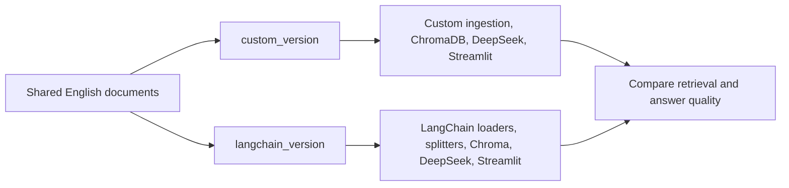

# RAG Demo Comparison Architecture

The detailed architecture and step-by-step notes are in [custom_version/ARCHITECTURE.md](custom_version/ARCHITECTURE.md). The repository now contains two parallel implementations:

