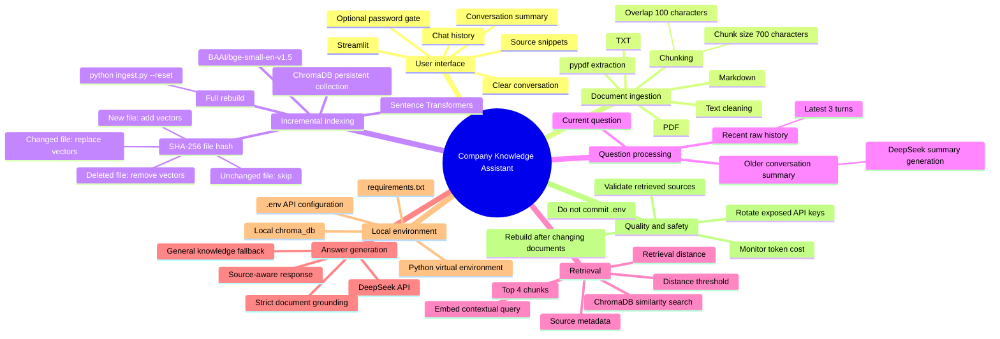
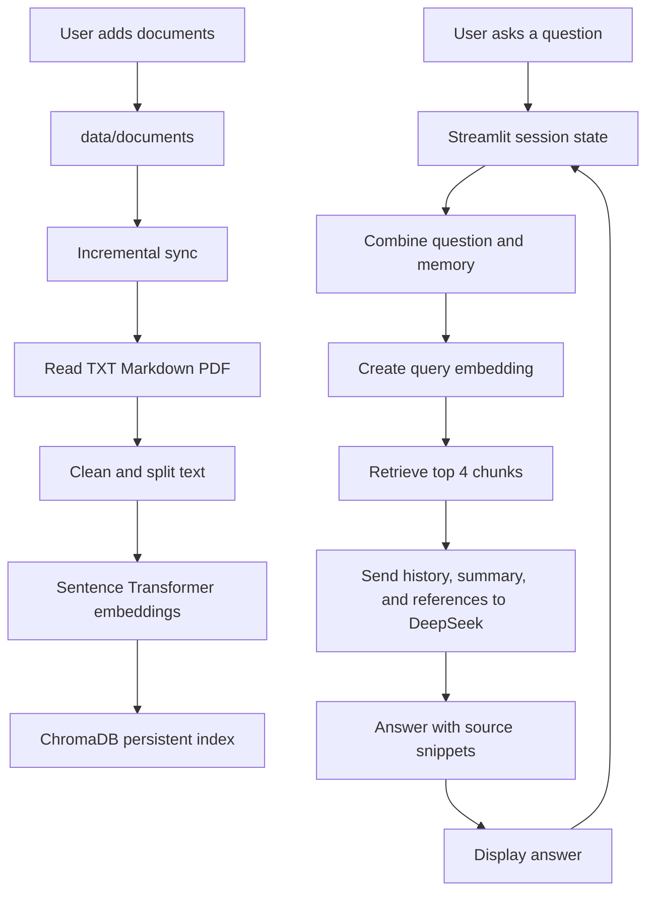

# RAG System Architecture

This document describes the current architecture, tools, data flow, and operational notes for the project.

## System Mind Map



## End-to-End Flow



## Step-by-Step Components

| Step | Location | Tool or technology | Purpose | Important notes |
|---|---|---|---|---|
| 1. Configure environment | `.env`, `.venv/` | Python virtual environment, `python-dotenv` | Isolate dependencies and load the DeepSeek key | Never commit `.env`; use `.env.example` as a template |
| 2. Add documents | `data/documents/` | TXT, Markdown, PDF | Provide the knowledge source | Keep documents authoritative, readable, and preferably in one language |
| 3. Read documents | `ingest.py` | `pathlib`, `pypdf` | Extract text from supported files | Scanned PDFs may require OCR, which is not implemented yet |
| 4. Split text | `split_text()` | Python string processing | Create retrieval-sized chunks | Current settings are 700 characters with 100-character overlap |
| 5. Detect file changes | `build_index()` | SHA-256 | Avoid re-embedding unchanged files | A changed file replaces all of its previous chunks |
| 6. Create embeddings | `ingest.py`, `rag.py` | Sentence Transformers, `BAAI/bge-small-en-v1.5` | Convert text and questions into vectors | The model is downloaded on first use and must be available locally |
| 7. Store vectors | `chroma_db/` | ChromaDB | Persist embeddings, text, and source metadata | The local database is ignored by Git and must be rebuilt on another machine |
| 8. Retrieve context | `rag.py` | ChromaDB similarity search and distance threshold | Find relevant chunks and reject weak matches | The threshold should be calibrated with the evaluation set |
| 9. Manage memory | `app.py`, `rag.py` | Streamlit session state, DeepSeek summaries | Keep recent turns and summarize older turns | Memory currently lasts only for the active browser session |
| 10. Generate answer | `rag.py` | DeepSeek API through the OpenAI-compatible client | Answer using the question, memory, and references | Company-specific answers must stay grounded in the documents |
| 11. Display evidence | `app.py` | Streamlit expander | Show source file, chunk number, distance, and text | Users should verify important answers against the source |
| 12. Sync new files | `python ingest.py` or **Sync document index** | Incremental indexer with content and schema metadata | Add, update, skip, or remove vectors as needed | Use `python ingest.py --reset` only for a deliberate full rebuild |
| 13. Protect the app | `.env`, `app.py` | Optional password gate | Restrict casual access to a local or private deployment | Use an identity provider for production authentication |
| 14. Deploy | `Dockerfile` | Docker, Streamlit, Tesseract, Poppler | Package the app and scanned-PDF OCR dependencies | Keep secrets outside the image and configure persistent storage |

## Common Operations

```bash
# Activate the project environment
cd /Users/yipeng/Documents/RAG_DEMO
source .venv/bin/activate

# Incrementally sync documents
python ingest.py

# Force a complete rebuild
python ingest.py --reset

# Run core tests
python -m unittest discover -s tests -p 'test_*.py'

# Evaluate retrieval against the sample question set
python tests/evaluate_retrieval.py

# Start the application
streamlit run app.py
```

## Current Limitations and Next Improvements

1. The memory is session-level and is lost when the Streamlit session ends.
2. Scanned PDFs are not processed with OCR.
3. Retrieval does not yet apply a calibrated relevance threshold.
4. There is no automated evaluation set for retrieval and answer quality.
5. Access control and document-level permissions are not implemented.
6. Production deployment needs secret management, logging, rate limits, and monitoring.
